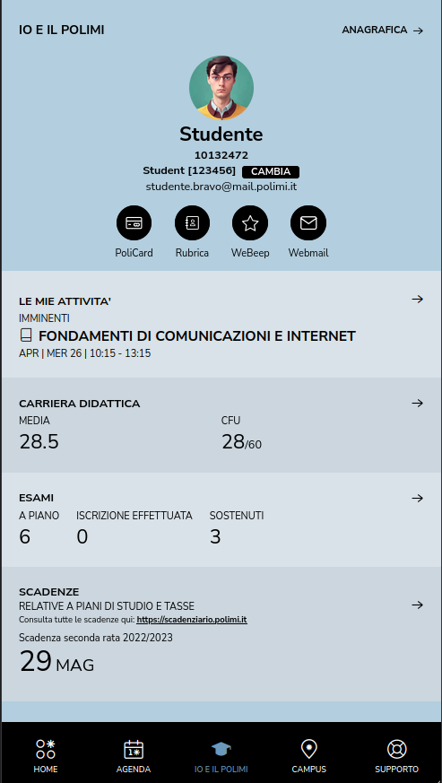

# Polimiapp Mockup
## Profile endpoint
   ``` 
   GET https://polimiapp.polimi.it/polimi_app/rest/jaf/internal/user 
   ```
   
   [user.json](user.json)
   
   ```
   GET https://polimiapp.polimi.it/polimi_app/rest/me/polimi/{MATRICOLA} 
   ```
   
   [grades.json](grades.json)
   
   ```
   GET https://polimiapp.polimi.it/polimi_app/agenda/api/me/{MATRICOLA}/deadlines?start_date=2023-04-22&end_date=2024-04-21 
   ```
   
   [deadlines.json](deadlines.json)
   
   result:
   
## Agenda endpoint
    ``` 
    GET https://polimiapp.polimi.it/polimi_app/app/agenda?view=calendar 
    ``` 
    
    [events.json](events.json)
